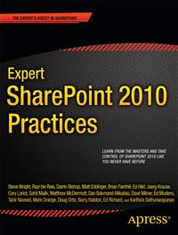

#Apress Source Code

This repository accompanies [*Expert SharePoint 2010 Practices*](http://www.apress.com/9781430238706) by Winsmarts LLC, Sahil Malik, Brian Farnhill, Razi bin Rais, Ed Richard, Ed Musters, Darrin Bishop, Matthew McDermott, Mark Orange, Cory R. Loriot, Matt Eddinger, Doug Ortiz, Tahir Naveed, Karthick Sethunarayanan, Barry Ralston, Steve Wright, Ed Hild, Joerg Krause, Dave Milner, and Dan Bakmand-Mikalski (Apress, 2011).

Download the files as a zip using the green button, or clone the repository to your machine using Git.

##Releases

Release v1.0 corresponds to the code in the published book, without corrections or updates.

##Contributions

See the file Contributing.md for more information on how you can contribute to this repository.
